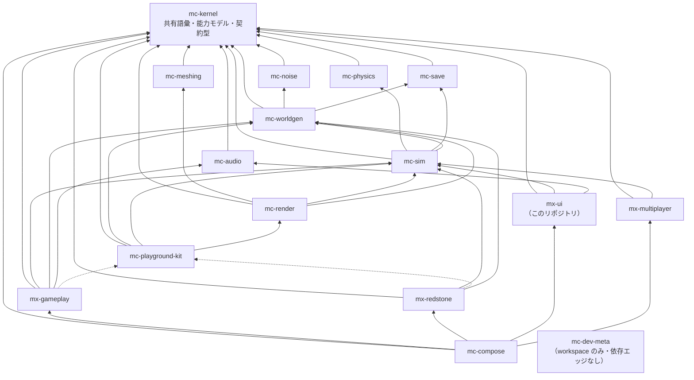

# アーキテクチャ

出典: plan.md §2。本書は plan.md の構成を mx-ui 視点で読み直し、
`scripts/check-dependency-whitelist.ts` と `test/stage-registration.test.ts` が機械的に強制している内容と対応づけたもの。

## 1. 4 階層（plan.md §2.2）

単一リポジトリ（参照実装 84k LOC）では「正しく動くことが保証される単位」が大きすぎた。
そこでゲーム UX を構成する体験単位ごとにリポジトリを分け、各リポジトリが単独で
「テスト green + プレビューで目視確認済み」を閉じる構成を採る。

| 階層 | リポジトリ | 性質 |
| --- | --- | --- |
| 安定ライブラリ | `mc-kernel` / `mc-noise` / `mc-meshing` / `mc-physics` / `mc-save` / `mc-audio` | 純粋関数・狭い界面・変更頻度が低い。相互独立で並行構築可能 |
| 基盤 | `mc-worldgen` / `mc-sim` / `mc-render` / `mc-playground-kit` | 状態とサービス（**名詞**）。体験モジュールが乗る土台 |
| 体験モジュール | `mx-gameplay` / `mx-redstone` / **`mx-ui`** / `mx-multiplayer` | ルールと UI（**動詞**）。互いを知らず、基盤サービス経由でのみ会話する |
| 合成 | `mc-compose` | Layer マージ + stage 順序表 + E2E。ロジックを持たない |

これに開発用の `mc-dev-meta`（各リポジトリの clone を `repos/` に並べて 1 つの pnpm workspace として束ねる薄いリポジトリ、
plan.md §6 Step 0）を加えて 16。

**mx-ui は体験モジュール層にいる。** 「UI だから一番上」ではない。上には `mc-compose` しかなく、
mx-ui は mx-gameplay や mx-redstone と**同じ高さ**に、互いを見ないまま並んでいる。

## 2. 依存グラフ（全 16 リポジトリ）

実線 = 実行時依存（`dependencies`）、点線 = プレビュー起動時のみ（`devDependencies`）。



**mx-ui の行に `kit` が無いことに注意。** mx-gameplay と mx-redstone には点線の kit エッジがあるが、
mx-ui には**実線も点線も無い**。plan.md §3.13:「kit 不要(DOMのみで起動)」。
プレビューが DOM だけで立ち上がるので、背後にミニ世界を束ねる糊が要らない。

このグラフは `scripts/check-dependency-whitelist.ts` の `REPOSITORY_POLICY.dependencyGraph` に転記されており、
`test/check-dependency-whitelist.test.ts` が
`carries the complete 16-repository roster, so cycle detection can see the whole organisation`
で「16 行あること」と「`checkPolicyConfiguration()` が空を返すこと（= 非循環・全エッジの行先が存在）」を検査している。

### `dependencyGraph` に書かないもの（2 種類）

| 書かないもの | 理由 |
| --- | --- |
| `@nerima-games/mc-kernel` を依存先として | kernel はどこからでも import 可。行に書くと `checkPolicyConfiguration` が `policy-config` で拒否する |
| kit エッジ | kit は devDependency 専用であり**実行時エッジではない**。実行時グラフに載せると `kit -> render -> sim` と各体験モジュールの `-> sim` により循環に見えてしまう。`mc-playground-kit` はキーとしてだけ存在し、どの体験モジュールの Set にも現れない |

## 3. mx-ui の親は 2 つだけ

```
@nerima-games/mx-ui -> { @nerima-games/mc-sim, @nerima-games/mc-audio }
```

`pnpm check:deps` の成功メッセージがそのまま宣言になっている:

```
check-dependency-whitelist: OK — 14 file(s) scanned, allowed direct dependencies:
@nerima-games/mc-audio, @nerima-games/mc-sim
(plus @nerima-games/mc-kernel, which every repository may import).
```

**mc-audio は 1 つの理由だけで親である。** plan.md §3.13 は依存を「sim / audio(字幕購読)」と書いており、
括弧の中身が全てである。mx-ui が使うのは `CaptionEventStream`（§4.3）だけで、
`SoundCuePort` で音を鳴らすのは mx-gameplay の仕事である。
これは `test/check-dependency-whitelist.test.ts` の
`mc-audio is a parent for exactly one reason: the caption event stream` に固定してある。

## 4. 中心のルール — 基盤 = 名詞、体験 = 動詞（plan.md §2.3-1）

**基盤は状態の置き場（名詞）、体験はルール（動詞）。**
`InventoryService` は mc-sim に、「掘ったらドロップしてインベントリに入る」は mx-gameplay に置く。

UI ではこの区別が他の 2 つより微妙になる。画面は状態を「見せる」ので、状態を「持っている」ように見えるからである。
具体的に切り分けると:

| これは名詞（mc-sim の資産） | これは動詞（mx-ui の資産） |
| --- | --- |
| 体力 19 点という値 | 「19 点の体力はハート 9 個と半分である」 |
| 空腹 / XP / インベントリ / 実績 / 統計 / 設定の値 | それらをどう並べ、どう欠けさせ、いつ隠すか |
| 「クリーパーが導火線に火を点けた」という事実 | 「同じキューの字幕は積み上げず更新する」 |
| どの画面が開いているかという要求 | 「Escape は最前面のモーダルを 1 枚だけ閉じる」 |

### ビューモデルは「導出」であって「コピー」ではない

`domain/hud-view-model.ts` の `hudViewModel(snapshot)` は `VitalsSnapshot` を受け取って `HudViewModel` を返す純粋関数である。
入力の状態を**保持しない**。`stages/registration.ts` の `UiFrameState.snapshot` が `Ref.Ref<VitalsSnapshot>` であるのも同じ理由で、
これは mc-sim の値の**写し**であって、mc-sim のオブジェクトへの生きたハンドルではない。

**mx-ui が他人のオブジェクトへの権威ある可変ハンドルを持った瞬間、「これは誰の所有物か」という問いに答えが無くなる。**

参照実装がまさにそれをやった。plan.md §3.8 が記録している**カメラ所有権の逆転**である:

> 参照実装は THREE カメラが正でシミュレーションが描画から視線を読む逆転構造だった
> （「camera.position を読むな matrixWorld を使え」という慢性 gotcha の根源）。
> 新実装は sim が姿勢を所有し、THREE カメラはミラー

描画側のオブジェクトが権威になった結果、シミュレーションが「今どこを見ているか」を描画に**問い合わせる**構造になり、
以後どちらを読めば正しいのかを毎回思い出す必要が生まれた。
mx-ui は描画側であり、同じ罠の同じ側にいる。`stages/registration.ts` の `UiFrameState.snapshot` のコメントは
このケースを名指しで参照している。

## 5. 体験モジュール間のエッジがゼロである理由

グラフ上でこれは「Tier 3 の 4 リポジトリの間にエッジが 1 本もない」として現れる。
`test/check-dependency-whitelist.test.ts` の
`REGRESSION: no experience module names another experience module in the graph` が固定している。

### 「採掘→インベントリに入る」の正しい読み方

```
mx-gameplay --write--> mc-sim.InventoryService <--read-- mx-ui
```

2 本の別々の関係であって、mx-gameplay と mx-ui の間には何も無い。
**mx-ui は採掘という機能が存在することをコンパイル時に一切知らない。**
これが「どちらのリポジトリももう一方に触れずに書き直せる」という性質を成立させている。

裏返すと、mx-gameplay 抜きでビルドしても mx-ui の HUD は動く。
インベントリが常に空になるだけで、壊れはしない。エッジを 1 本足した瞬間にこれが失われる。

### mx-ui が最も難しい場所である理由

**UI の要素はほぼ全て、どこか他のモジュールのルールが出した結果を表示している。**
ホットバーは採掘の結果を、体力バーは戦闘の結果を、字幕は mc-audio のキューを、
レッドストーンのツールチップは mx-redstone の電力伝播を映す。
mx-gameplay や mx-redstone なら「相手を import したくなる場面」がそもそも稀だが、mx-ui では毎画面それが来る。

誘惑は具体的にこう見える:

> ホットバーは採掘の**後**に更新されてほしい。だから `after: [StageId('gameplay:interactions')]` と書こう。

これは順序制約のように読めるが、実際にはシミュレーションに対する制約である。
mx-gameplay は mc-sim に書き、mx-ui は mc-sim を読む。だから mx-ui が本当に必要としているのは
**シミュレーションの後に走ること**であり、それは `stages/stage-ids.ts` の `UPSTREAM_STAGE_IDS.simPhysics`
（`StageId('sim:physics')`）が既に言っている。

しかも `after: [StageId('gameplay:interactions')]` は:

1. **正しく見える。**
2. **`pnpm check:deps` を通ってしまう。** `StageId` は文字列であって import ではないので、import ゲートには見えない。
3. **mx-gameplay を含まないビルドで HUD を配信不能にする。**

### だからゲートが 2 つある

| ゲート | 実装 | 捕まえるもの |
| --- | --- | --- |
| import ゲート | `scripts/check-dependency-whitelist.ts` | 未許可パッケージ / 推移閉包 / 宣言漏れ / kit の実行時混入 / 壁時計直読み |
| stage ゲート | `test/stage-registration.test.ts` | `after` に書かれた `StageId` **文字列** |

### ゼロエッジは対称である

「mx-ui が mx-gameplay を import できない」だけでは半分しか言っていない。
**mx-gameplay も mx-ui を import できない。**
採掘がホットバー UI に手を伸ばすのは、ホットバー UI が採掘に手を伸ばすのと同じだけ禁止である。

`REPOSITORY_POLICY.dependencyGraph` は 16 リポジトリ全部の行を持っているので、
このリポジトリのコピーだけで**他のリポジトリの席から見たときの判定**も検査できる。
`classifyImport` は `PolicyView` を受け取れるようになっており、
`test/check-dependency-whitelist.test.ts` の describe
`the roster, read from the seat of another repository` が 3 方向から固定している:

- `REGRESSION: seated in mx-gameplay, importing mx-ui is rejected — the zero-edge rule is symmetric`
- `mc-compose IS allowed to import mx-ui — it is the one repository that may`
- `REGRESSION: mc-render owns the input service and reaches mc-sim; mx-ui does neither`

3 本目が §6 の入力境界をグラフ側から言い直している。
mc-render は mc-sim を import してよく、mx-ui も mc-sim を import してよい。
**しかし mx-ui は mc-render を import できない**ので、
リマップ画面が編集するキーバインディングは mc-sim の設定状態を通って往復する。

stage ゲートの中身は `stages/stage-ids.ts` の `EXPERIENCE_MODULE_STAGE_PREFIXES`
（`['gameplay:', 'redstone:', 'ui:', 'multiplayer:']`）と `OWN_STAGE_PREFIX`（`'ui:'`）で、
テスト名がそのまま主張になっている:

> `REGRESSION: no `after` edge names another experience module — "the hotbar updates after mining" is NOT an ordering constraint on gameplay`

**2 つのゲートは別の穴を塞いでいる。** どちらか一方では足りない。

## 6. 推移閉包は認めない

依存は**その依存先を import してよいという許可であって、その先を import してよいという許可ではない**。

```
mx-ui -> mc-sim -> mc-worldgen
```

のとき、mx-ui は mc-worldgen を import **できない**。mc-save も mc-physics も同様である。

一番惜しいケースは**ワールド選択画面**で、保存済みワールドの一覧を出したいのだから
mc-save か mc-worldgen を読みたくなる。**読まない。mc-sim に訊く。**
mc-sim が公開していないなら、それは mc-sim の公開 API の話であって mx-ui の依存の話ではない。

違反時のメッセージは経路つきで出る（`classifyImport` の `transitive-import`）:

```
stages/registration.ts:12 [transitive-import] imports @nerima-games/mc-worldgen,
which @nerima-games/mx-ui only reaches transitively
(@nerima-games/mx-ui -> @nerima-games/mc-sim -> @nerima-games/mc-worldgen).
A transitive dependency is not an import licence. Either declare it as a direct
dependency (REPOSITORY_POLICY.dependencyGraph + package.json), or do not import it.
```

この文字列は `test/check-dependency-whitelist.test.ts` の
`REGRESSION: mx-ui may NOT import mc-worldgen just because mc-sim does` が実際に照合している。

### mc-render も親ではない

mx-ui と mc-render は**同じ画面を共有している**。ゲームの canvas の上に HUD が乗るのだから、
親子でもおかしくないように見える。**親ではない。**

- 実行時入力サービス（キーボード / マウス / ポインタロック / タッチ / キーリマッピング）は
  **mc-render の所有**である（plan.md §2.3-2、§3.9）。
- mx-ui が持つのは**キーリマッピングの画面**であって、バインディングそのものではない。
- そのバインディングは mc-sim の設定状態を経由して mx-ui に届く。新しい依存エッジではない。

`test/check-dependency-whitelist.test.ts` の
`REGRESSION: mc-render is not a parent, even though mx-ui and mc-render share a screen`
が `not-whitelisted` を固定している。`domain/accessibility.ts` の `InputAction` union が
「PROVISIONAL: the authoritative action list belongs with the runtime input service」と書いてあるのはこの理由である。

## 7. 分割しないと決めたこと

### 7-1. mx-ui を画面別に割らない（plan.md §5.3）

| 候補 | 棄却理由（plan.md §5.3 原文） |
| --- | --- |
| mx-ui の画面別分割 | 「DOMのみでCIが軽く、プレビューは複数エントリで既に独立起動できる。利得ゼロ」 |

分割の利得は普通「CI が重いので切りたい」か「独立に起動したいので切りたい」のどちらかである。
mx-ui はどちらも既に満たしている。CI は DOM だけなので軽く
（現状の全 suite が 409 ms、[testing.md](./testing.md) §2）、
独立起動は `apps/preview-*/` の複数エントリで達成できる（plan.md §4.1、§2.4「プレビューは起動の単位」）。
残るのはリポジトリを増やすコストだけになる。

代償は本書 §5 が言っている通り、**このリポジトリが最終的に全画面を抱える**ことである。
UI 全部を含むリポジトリは、import を 1 本足すだけでゲーム全部に依存するリポジトリになる。
`test/check-dependency-whitelist.test.ts` の冒頭コメントがこの因果をそのまま書いている。

### 7-2. モジュールの上に UI 専用リポジトリを作らない（plan.md §2.3-4）

> プレビューは検証対象と同居する。地形プレビューは worldgen 内、障害物コースは sim 内。
> **UIだけの独立リポジトリは作らない（全ロジックに依存する巨大検証単位が再発する）**

「全画面をまとめる層」を体験モジュールの上に置くと、その層は 4 つの体験モジュール全部に依存する。
それは mc-compose と同じ形をしていて、しかもロジックを持ってしまう。
参照実装が合成層に 13k LOC のルールを堆積させ、E2E でしか検証できなくなった構造（plan.md §3.15）の再発である。

## 8. リポジトリ / パッケージ / プレビューを混同しない（plan.md §2.4）

| 単位 | 役割 | 粒度 |
| --- | --- | --- |
| リポジトリ | 検証・リリースの単位（CI / バージョン / 公開） | 16 個で固定 |
| パッケージ | 依存境界の単位（リポジトリ内 workspace で維持） | 自由に細かく |
| プレビュー | 起動の単位 | 1 リポジトリに複数可 |

§7-1 の「画面別に割らない」はリポジトリの話であり、**パッケージとプレビューの話ではない**。
画面ごとにリポジトリ内 workspace を切ることも、画面ごとにプレビューを立てることも、何も禁じていない。
むしろ後者は完成条件そのものである（plan.md §3.13:「状態モック付きプレビュー(各画面を単体起動して操作)」）。
